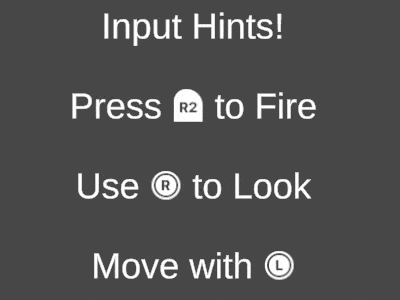
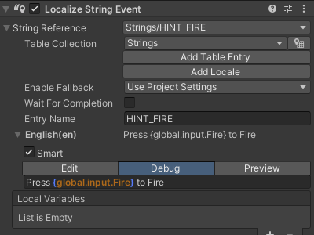
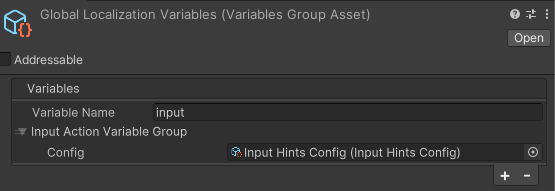
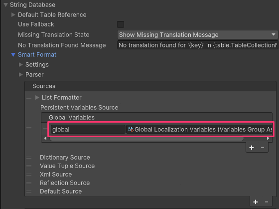
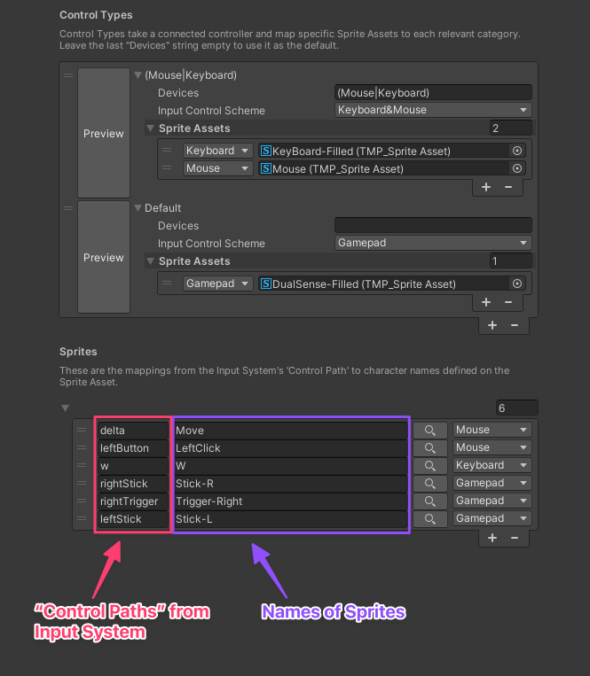

# Input Hints

Input hints are little prompts in game that display the button, key or action that the player needs to perform to
execute a certain action. 

> Press [A] to Jump

Unity's new Input and Localization systems are perfect for displaying dynamic Input Hints, changing depending on
the actual bindings set up in the Input Actions. TextMesh Pro is used for displaying sprites inline in text strings.
All that it needs is a little bit of plumbing, and this package is that plumbing!

## How to use

You will need actual icons to display in the text. I can recommend the excellent 
[PC & Consoles Controller Buttons Icons Pack](https://assetstore.unity.com/packages/2d/gui/icons/pc-consoles-controller-buttons-icons-pack-85215).
This package is based around the way they set up sprites.

1. Install the package from the git URL
2. I'm assuming you already have [Input Actions](https://docs.unity3d.com/Packages/com.unity.inputsystem@0.9/manual/ActionAssets.html) 
   and the [Localization System](https://docs.unity3d.com/Packages/com.unity.localization@1.4/manual/QuickStartGuideWithVariants.html) set up.
3. In Unity, go to `Assets/Create/Noio/Input Hints Config`
4. Follow instructions on the Input Hints Config asset.
5. Check out `DeviceDetectorSample.cs`

### Manual Setup
If the button to automatically hook up the Localization Settings "Smart Format Source" does not work, this is
the manual setup required:

1. Click to **Assets > Create > Localization > Variables Group**
2. In the newly created _Variables Group Asset_, add a variable, name it "input" and link the Input Hints Config.

3. Go into the Localization Settings Asset and open up **String Database > Smart Format > Sources > Persistent Variables Source**
4. Add the _Variables Group Asset_ that you created in Step 1:

                                                                   

## Sample Setup

See below for a sample setup that uses the actions defined in Unity's Default Input Action Map (Look, Move, Fire), and 
the controller icons linked above.

